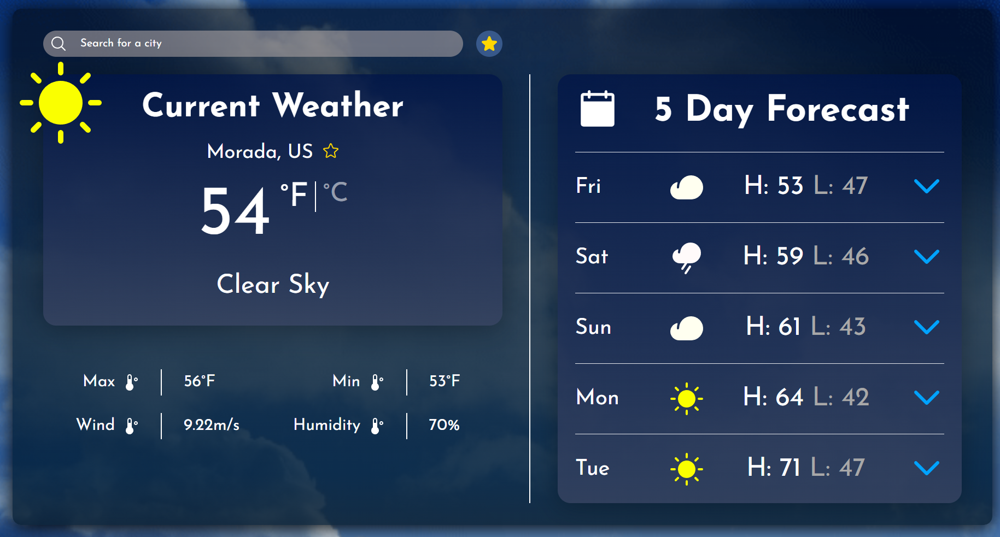

Jayvon Khuth

3/28/2024

Weather App Rebuild

I was tasked to recreate my original weather app design, that I designed in figma. The technologies I used to create this website app is Html, CSS, OpenWeatherAPI & Javascript/Typescript, and for the frameworks I used Next JS & TailWind CSS. What I did to make my web app work is I used api chaining and also leveraged local storage to be able to see past searches and favorite cities. Recreating this application was a bit challenging, but in the end I had lots of fun recreating my original weather app design.

Peer Reviewer: Tyler Nguyen (8:57AM)
Peer Review: Great looking application. I like how you did the recent search to populate when you try to search a location. The search input is very nice, I like the way you coded it. The transition from Desktop to mobile is smooth. One bug you have is when you switch from F to C. In your accordion component, it still says F instead of switching to C. Overall application looks just like the Figma and operates as a weather application.

Edit: Jayvon Khuth - I fixed the component accordion bug, all I had to do was add another prop to the weekday component

LINKS:
Figma - https://www.figma.com/file/p1BcHrGsq1wEIrLkMJlSzg/Weather-App-figma?type=design&node-id=10%3A50&mode=design&t=N47t5CgGsB4W88iC-1
Vercel - [https://weather-app-rebuild.vercel.app/](https://weather-app-rebuild-one.vercel.app/)
Github - https://github.com/JayvonK/WeatherAppRebuild
